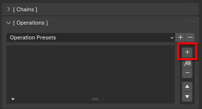
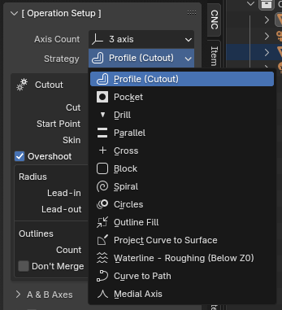
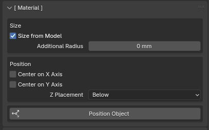
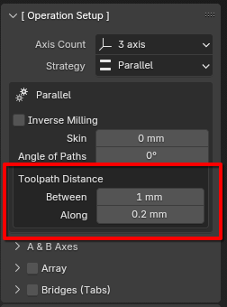
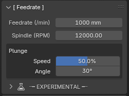
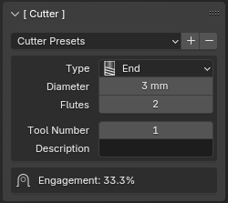
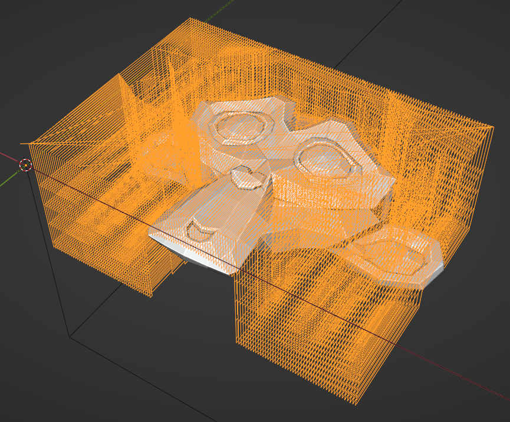
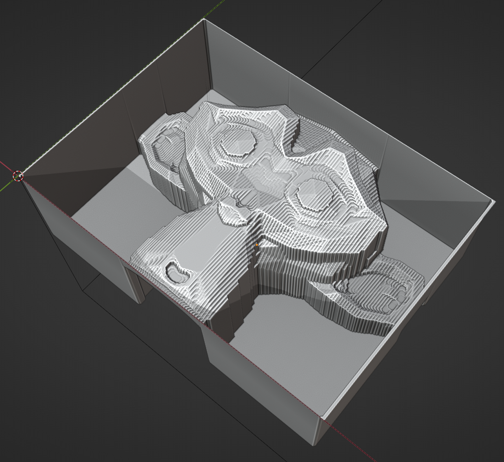
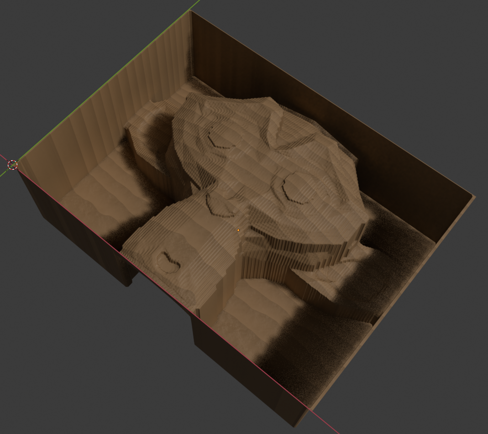

# Getting Started

This is a step-by-step tutorial on generating your first toolpath with Fabex.

For detailed descriptions of Panel options go [here](interface.md).

## Setup your Scene
You can use any object to generate toolpaths, but for the purpose of this guide we will use Suzanne, the monkey.

To reproduce the results shown below you will need to:
- select and delete the default cube
- click **Add** > **Mesh** > **Monkey** _(or press Shift+A to get the Add Menu and do the same)_

Now we are going to scale and rotate the monkey head so that it gives us the best results and doesn't trigger any warnings about being too big for our machine:
- press **S**, then **.05** on your keyboard to scale it down
- press **R**, then **X**, then **-90** to rotate it on the X axis by -90 degrees
- press **S**, then **Z**, then **.5** to scale it down on the Z axis

> [!NOTE]
> _If you don't feel the need to reproduce the guide results exactly, you can skip all of the above and perform the operations on the default cube, but you will get a warning about the object being too big for your machine if you don't scale it down to fit inside the **CAM_machine** area._

## Change the Render Engine
In the **Properties** area, in the **Render** tab, set the **Render Engine** to **Fabex CNC/CAM**

## Setup your Machine Parameters

In the **[ Machine ]** panel, enter the specs of your CNC Machine, including:
- **Post-Processor**
- **Unit System** *(Metric or Imperial)* & **Length Unit** *(ft, in, m, mm)*
- **Work Area**
- **Feedrate** & **Spindle Speed** Min/Max
- **Machine G-code** output options
- Custom **Position Definitions** for Start, End and Tool Change 
- Multi-Axis Options and more

## Add an Operation

In the **[ Operations ]** panel, click the **+** button to add a new Operation.

_Once an Operation has been added, the rest of the Interface will populate with Operation settings panels._

## Choose a Milling Strategy

In the  **[ Operation Setup ]** panel, choose **Parallel** from the **Strategy** dropdown. 

**Outline Fill**, **Circles**, **Spiral**, **Block**, or **Cross** will also work for this example. 

**Waterline** and other operations require curve data source. See how to generate curves from mesh model [here](Profile%20and%20Pocket%20operations.md).

> [!NOTE]
> _If you are not sure what each milling strategy does, check the Strategy page for pictures and explanations of how each works._

## Setup Stock Material and Position your Object

In the **[ Material ]** panel, click **Size from Model** to allow Fabex to auto-calculate the size of the required Stock Material, you can then set **Additional Radius** to mill additional stock around object. 

If you know the dimensions of your stock, e.g. a plywood sheet, you can uncheck **Size from Model** and enter the dimensions manually.

You can manually position object inside the Machine's Work Area, or use **Position Object** to position it automatically using the listed alignment options.

> [!NOTE]
> _If the box representing material doesn't update, uncheck **Size from Model** and then check it again._

## Configure the Operation Settings
### [ Operation Setup ]
In the **[ Operation Setup ]** panel, under the **Parallel** settings, find **Toolpath Distance**.

**Between** is the distance between toolpaths, and allows you to set Stepover values to determine how close each path should be to the next.

**Along** determines path accuracy. Paths are made up of points, and the lower the distance between them, the more points you will have. 

Lower values result in more accurate toolpath, but make computation slower and increase amount of resulting G-code.

### [ Optimisation ]
Click to enable **Exact Mode** - it improves accuracy. 

You can also select **Use OpenCAMLib** - it improves accuracy and speeds up the computing time. 

*OpenCAMLib also enables a high quality algorithm to calculate waterline toolpaths.*

### [ Operation Area ]

In the **[ Operation Area ]** panel, click the arrow next to **Layers** to enter a **Layer Height**.

Under **Operation Depth** you can set the **Start** and **Max** depth. 

_**Max** depth is set to auto-calculate from the selected **Object** by default._

### [ Feedrate ]

Set the **Feedrate** _(in units per minute)_ and **Spindle** speed _(in revolutions per minute)_ for the Operation. 

***Plunge** **Speed** and **Angle** allows slows down the operation feedrate when the cutter is moving down on steep areas.*

### [ Cutter ]

Specify your Cutter **Type**, number of **Flutes** and **Diameter.**

*Set the **Tool Number** and **Description** if applicable.*

## Calculate Path and Generate Gcode

Back in the **[ Operations ]** panel, click **Calculate Path & Export Gcode**.

This will calculate the toolpath, add it to the Blender scene and export a Gcode file to the same directory as your .blend file.

## Operation Simulation

Click **Simulate This Operation** to create model representing your machined material. 

You can use this to determine your best milling strategy, how much finishing work a job will need, etc.

Or, combine it with Blender shaders and HDRIs to get a better idea of what your piece will look like in your chosen material, with light and shadow.

## Combine Multiple Operations in a Chain

You may need to combine multiple strategies and Opertations to achieve your desired result, and chains make that possible.

Chains allow you to combine multiple Operations for Gcode export or Simulation.

In the **[ Chains ]** panel, click the **+** button to add a new Chain.

This will add a second box below the first to hold the Operations for this Chain.

Click the lower **+** button to add the active Operation to your Chain.

